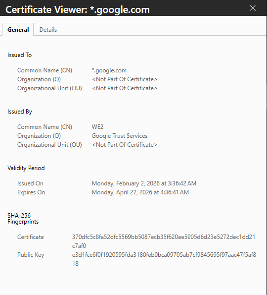

# Week 01 Lab — Certificate Inspection

## Screenshot Evidence

1. Capture a screenshot of the certificate details in your browser.
2. Save it as:

assets/screenshots/week-01/certificate-inspection.png

3. Embed the screenshot below:

## Website Information

**Website inspected:**  
https://www.google.com/

**Issuer (Certificate Authority):**  
WE2 Google Trust Services 
**Valid from:**  
February 2nd,2026
**Valid until:**  
April 27th, 2026
**Signature algorithm:**  
X9.62 ECDSA signature with SHA-256
---

## Subject Alternative Names (SAN Entries)

List at least 2–3 SAN entries:

- 
- 
- 

---

## Observations

Document three observations about the certificate.

### Observation 1
I noticed that there is a Public Key listed on the certificate for the Google website.
### Observation 2
The certificate expires only two months after it became active.
### Observation 3
This certificate is version three.
---

## Reflection

The certificate helps secure HTTPS communication by verifying that the website is legitimate and trusted. It contains a public key that allows the browser and server to begin an encrypted connection using TLS. This encryption protects the data sent between the user and the website from being intercepted or altered.
(2–3 sentences)
