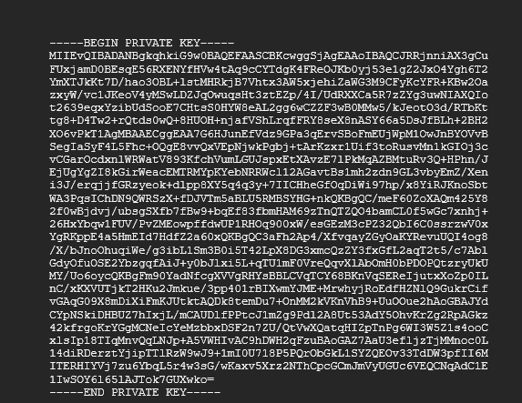

# Week 01 Lab — Key Pair Generation

## Screenshot Evidence

If using OpenSSL:
1. Capture a screenshot showing:
  - The command used to generate the private key
  - The command used to extract the public key
2. Save it as:

**assets/screenshots/week-01/keypair-generation.png**

3. Embed the screenshot below:

If using a browser-based generator, capture the generated key pair screen (redact sensitive portions of the private key before committing).

---

## Key Identification
**Which file is the public key?**

**Which file is the private key?**

---

## Key Properties
Briefly describe:
- What makes the public key safe to share A public key is safe to share because it is used to encrypt data or verify signatures but cannot be used to determine the private key. The private key is required to decrypt the data.
- What makes the private key sensitive: The private key must remain secret because it is used to decrypt encrypted data and verify identity. If someone gains access to the private key, they could impersonate the owner or access protected information.

---

## Security Scenario
What would happen if someone obtained your private key? If someone obtained my private key, they could decrypt sensitive data and impersonate my identity. This would compromise the security of communications and any systems that rely on that key for authentication.

Explain the risk in terms of:
  - Identity If someone obtained my private key, they could claim my digital identity and access systems or data that trust my certificate.
  - Impersonation The attacker could impersonate me by using the private key to sign or decrypt communications, making it appear as if the actions were coming from me.
    
  - Trust If the private key is compromised, the trust associated with that certificate is broken. Other systems would no longer be able to trust communications or identities verified by that key.

---

## Observations
Document three observations from this lab.

### Observation 1
I noticed that both keys had a variety of numbers, letters, and symbols that did not appear to be in a particular order like a structured sentence.

### Observation 2
The private key appears to have more complexity in terms of the amount of characters used to create the key.

### Observation 3
The private key was significantly longer than the public key.

---

## Reflection
In 3–5 sentences, explain:

Why must the private key remain secret in a PKI system?

Focus on how identity is tied to possession of the private key.

Identity  
If someone got my private key, they could take over my digital identity. Systems that trust my certificate would think they are communicating with me.

Impersonation  
They could pretend to be me in secure communications by using my private key to sign or decrypt information.

Trust  
If a private key is compromised, the trust connected to that certificate is broken because others can no longer be sure the real owner is the one using it.
