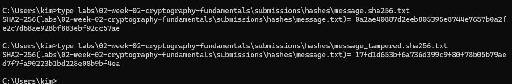

# Lab — Hashing & Integrity

## Overview
This lab focused on understanding how cryptographic hashing works and how it is used to detect changes in data. The goal was to generate a hash of a file, modify the file, and observe how the hash value changes completely after even a small modification.

---

## Environment

- Operating System: Windows
- Terminal Used: OpenSSL Command Prompt
- OpenSSL Version: OpenSSL 3.6.1

---

## Steps Performed

1. Created a plaintext file using the echo command
2. Generated a SHA-256 hash of the file using OpenSSL
3. Modified the file by adding additional text
4. Generated a new SHA-256 hash after modification
5. Compared both hash outputs to observe differences

---

## Results

The original file was hashed using SHA-256, producing a fixed-length hexadecimal output. After modifying the file by adding the word "tampered", a completely different hash value was generated.

This demonstrated that even a small change in the file results in a completely different hash.

---

## Key Findings

- Hash values change completely even with small modifications
- SHA-256 produces a fixed-length hexadecimal output
- Hashing does not hide data (not encryption)
- Hashing is used to detect data integrity

---

## Explanation

Hashing is important because it ensures data integrity. If a file is changed, even slightly, the hash value will change significantly. This makes it easy to detect tampering.

Hashing does not provide confidentiality because the original data is not encrypted and can still be read. Instead, hashing is used to verify that data has not been altered.

In PKI systems, hashing is used in certificate signatures, file verification, and code signing to ensure data has not been modified.

---

## Challenges / Troubleshooting

One challenge encountered was incorrect command syntax when generating hashes. This was resolved by using the correct SHA-256 flag (-sha256) in the OpenSSL command.

Another issue was file path confusion, which was resolved by carefully following the correct directory structure.

---

## Artifacts

- message.txt
- message.sha256.txt
- message_tampered.sha256.txt
- screenshots stored in assets/screenshots/week-02/

