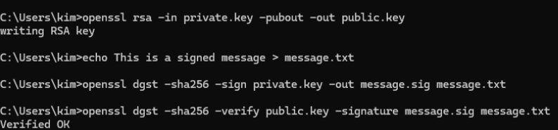

# Lab  — Digital Signatures

## Overview
This lab focused on understanding how digital signatures provide authentication and integrity using asymmetric cryptography. The goal was to sign a message using a private key and verify it using a corresponding public key, demonstrating how PKI ensures data has not been altered and confirms the identity of the sender.

---

## Environment
- Operating System: Windows  
- Terminal Used: OpenSSL Command Prompt  
- OpenSSL Version: OpenSSL 3.x  

---

## Steps Performed
1. Generated a private RSA key using OpenSSL.  
2. Derived a public key from the private key.  
3. Created a plaintext file containing a sample message.  
4. Used the private key to generate a digital signature for the message.  
5. Verified the digital signature using the public key.  

---

## Results
The message was successfully signed and verified. The verification command returned **“Verified OK”**, confirming that the message had not been altered and that it was signed by the correct private key.

---

## Key Findings
- Digital signatures ensure both authenticity and integrity of data.  
- A private key is required to create a signature, while a public key is used to verify it.  
- Any change to the original message would result in a failed verification.  
- This process is a core component of PKI and secure communications.  

---

## Explanation
The results matter because digital signatures are used to establish trust in secure systems. In PKI, verifying a signature ensures that data originates from a trusted source and has not been modified in transit. This is critical in applications such as secure websites, software updates, and email security. Without signature verification, systems would be vulnerable to tampering and impersonation attacks.

---

## Challenges / Troubleshooting
- Initially encountered an error where OpenSSL was not recognized in PowerShell.  
- Resolved the issue by using the OpenSSL Command Prompt, which has the correct environment configuration.  
- Also confirmed correct file paths before generating and verifying signatures.  

---

## Artifacts
- private.key  
- public.key  
- message.txt  
- message.sig  
